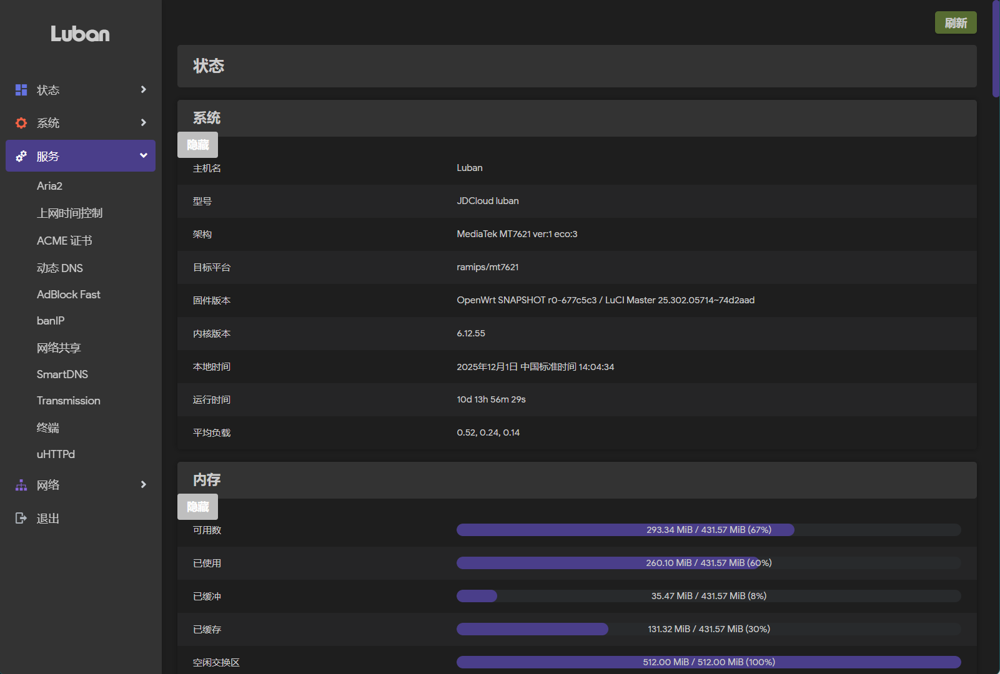
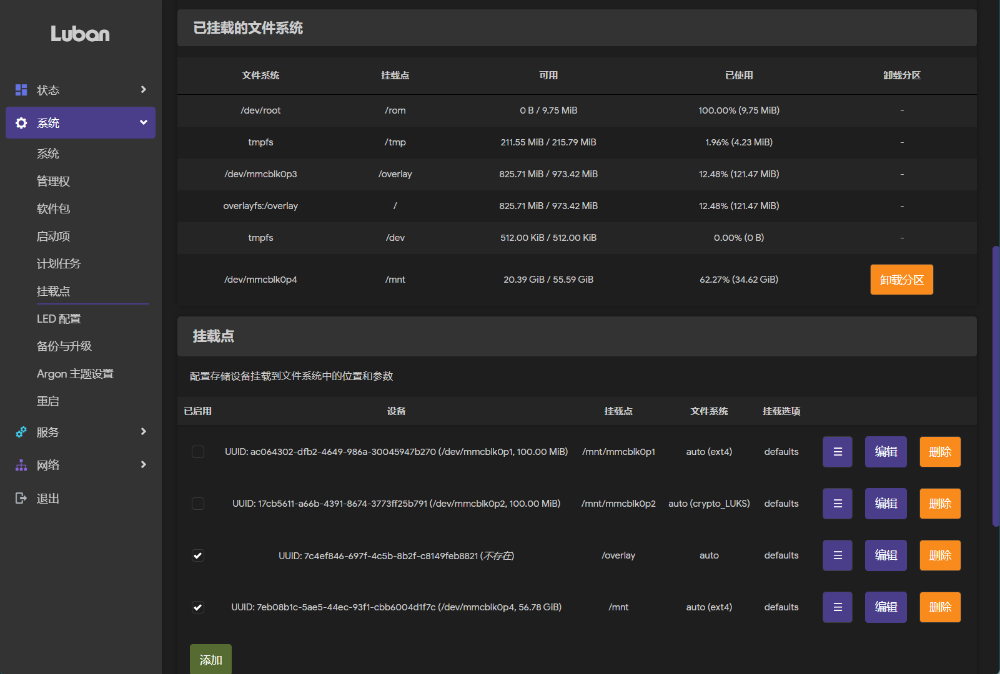
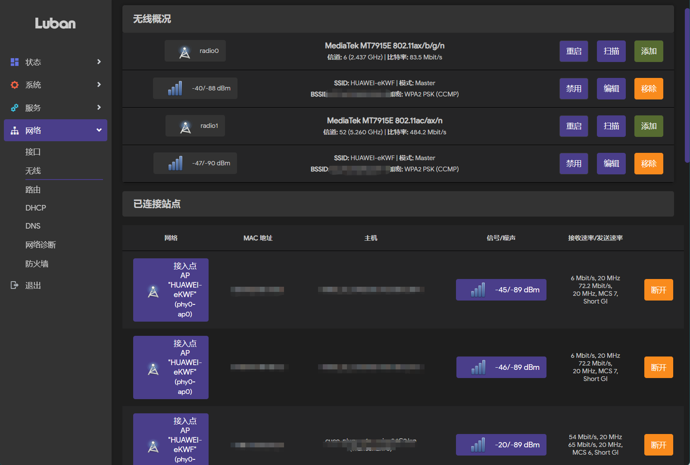
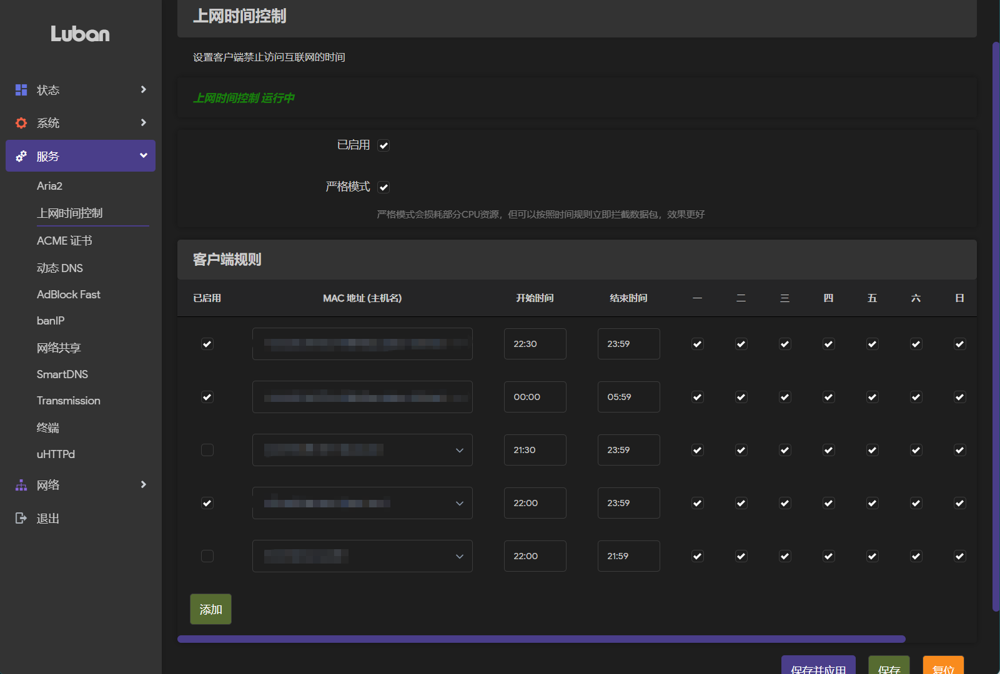

# 京东云AX1800路由器CI自动编译固件

本项目自动编译京东云鲁班，型号RE-CP-02(MT7621平台)的路由器固件，OpenWRT官方源码。

|   Snapshots   |   |
| ------------- | ------------- |
|||
|||

## 特点

- [OpenWRT](https://github.com/openwrt/openwrt)官方源码，和设备专用补丁
- 全功能OpenSSH
- 编译全部KMOD安装包，确保安装软件不缺依赖，KMOD安装包在压缩包文件snapshots.tar.gz中

## 刷机

刷机需要拆机用TTL刷，详细方法过程参考B站的[视频](https://www.bilibili.com/video/BV1ynApeBEqq/)。

UBoot刷好之后，按住RESET键插电，进入UBoot的web刷机界面刷入本固件

固件刷好后，可以在Luci的升级界面刷入sysupgrade.bin进行固件更新

## 鼓励一下

如果你从本项目中受益，欢迎捐赠一杯咖啡 ☕。  
这不仅是对我持续维护的动力，也让开源精神得以延续。

| 微信支付  | 支付宝 |
| ------------- | ------------- |
|   |  |
